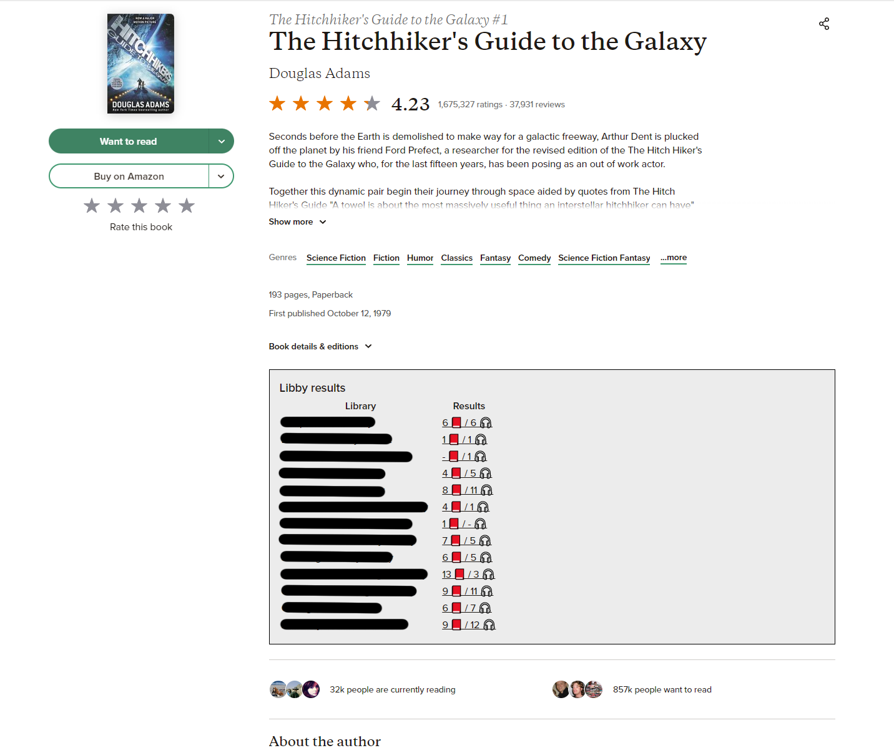

# Goodreads Libby Userscript

Userscript that will search for the book you are looking at on Goodreads across all your libby libraries.

## Installation

1. Make sure you have a browser extension that can run userscripts:

    * [Tampermonkey](https://www.tampermonkey.net/)
    * [Violentmonkey](https://violentmonkey.github.io/get-it/)
    * [Greasemonkey](https://addons.mozilla.org/firefox/addon/greasemonkey/)

2. Install:

    * Install the script directly from GitHub through this link: [Install](https://github.com/Dylancyclone/goodreads-libby-userscript/raw/main/goodreads-libby.user.js).
    * Install the script from [GreasyFork](https://greasyfork.org/en/scripts/440958-goodreads-libby-results) (GF)
<!-- * Or, install the scripts from [OpenUserJS](https://openuserjs.org/users/Dylancyclone/scripts) (OU). -->

## Usage

Go to the libby web app's main menu (https://libbyapp.com/interview/menu) and click the "Save Libraries" button.

Then, search for a book on Goodreads. When you've found a book, the userscript will search across all your libby libraries and show the results under the book's description.

You can then click the number of results to be taken to the search page for that library.

## Updating

Userscripts are set up to automatically update. You can check for updates from within the Greasemonkey or Tampermonkey menu, or click on the install link again to get the update.

## Issues

Please report any issues within this repository's [issue section](https://github.com/Dylancyclone/goodreads-libby-userscript/issues). I'm not a very active userscript developer, so Greasyfork messages are a little more difficult to work with. Thanks!
